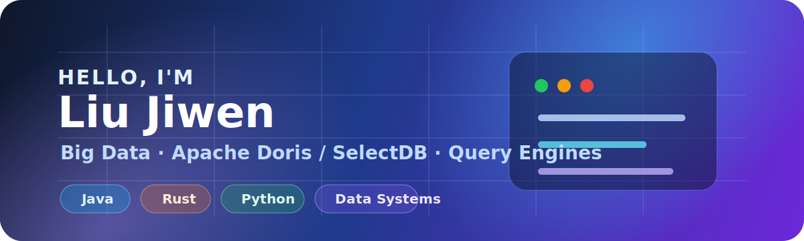
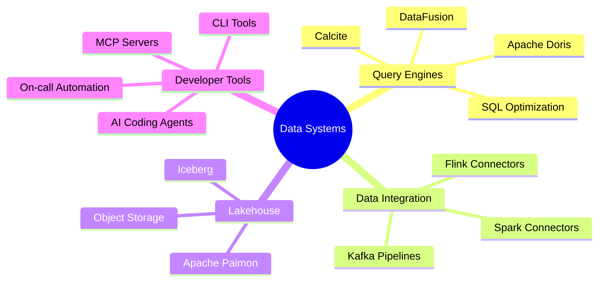

# Hi, I'm Liu Jiwen 👋

<!-- GitHub profile README for @liujiwen-up -->

**Big Data Engineer · Apache Doris / SelectDB · Query Engines · Cloud Native Data Systems**

I enjoy building analytical database systems, data connectors, developer tools, and AI-assisted engineering workflows.

---

## 🚀 About Me

- 🔭 Working around **Apache Doris / SelectDB** and real-time analytical data platforms
- 🧠 Interested in **query engines**, **lakehouse formats**, **distributed systems**, and **database internals**
- 🛠️ Building tools with **Java**, **Rust**, **Python**, **TypeScript**, and shell automation
- 🤖 Exploring AI-assisted coding, MCP servers, Codex/Claude-style developer workflows, and on-call automation
- 🌱 Currently reading and hacking around **DataFusion**, **Paimon**, **Flink**, **Kafka**, **Calcite**, and **SQLGlot**

## 🧰 Tech Stack

  

## 🗺️ What I Like Working On

## 📌 Featured Projects & Interests

| Area | Repositories / Topics | What I focus on |
| --- | --- | --- |
| OLAP & Databases | `doris`, `selectdb-core` | Query execution, storage, diagnostics, observability |
| Connectors | `doris-flink-connector`, `doris-spark-connector` | Streaming/batch integration with analytical databases |
| Lakehouse & Formats | `paimon-rust`, `paimon-mosaic`, `iceberg` | Table formats, object storage, Rust implementations |
| Query Tooling | `sqlglot-doris`, `datafusion`, `calcite` | SQL parsing, planning, optimization, compatibility |
| Dev Productivity | `doris-mcp-server`, `cloud-cli`, `dotfiles` | CLI workflows, MCP, automation, AI-assisted engineering |

## 📊 GitHub Stats

## 🧭 Current Focus

- Improving reliability and debuggability for analytical database workloads
- Understanding query profiles, planner/runtime behavior, and performance bottlenecks
- Building practical AI agents for code reading, alert triage, and engineering knowledge capture
- Keeping my local development environment fast, reproducible, and automation-friendly

## 🤝 Connect

- GitHub: [@liujiwen-up](https://github.com/liujiwen-up)
- Feel free to open issues, discussions, or reach out around Doris, data systems, query engines, and developer tooling.

---

_Thanks for visiting. May your queries be fast and your profiles easy to read._ ⚡

